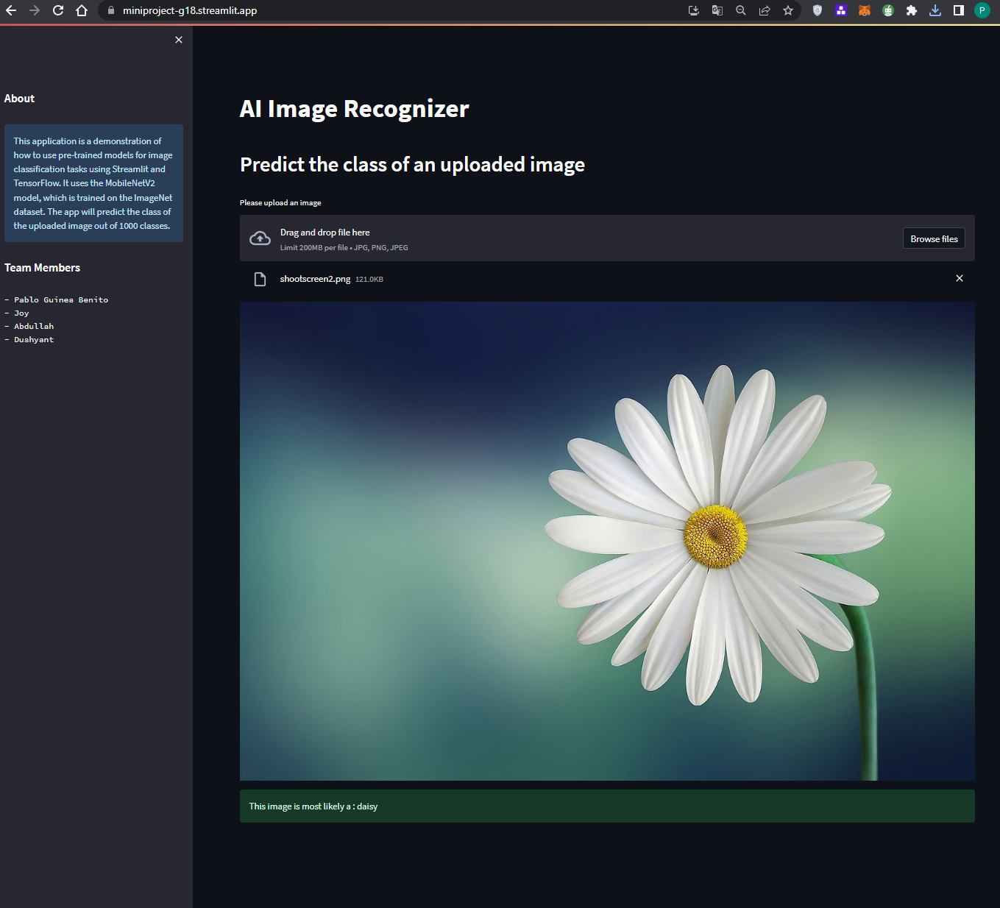

# AI Image Recognizer

This is a Streamlit application that uses a pre-trained MobileNetV2 model from TensorFlow to classify uploaded images into one of 1000 categories.

## How to run the app

1. Clone this repository
2. Install the dependencies with `pip install -r requirements.txt`
3. Run the app with `streamlit run app.py`

## Screenshot

Interact with the app: https://miniproject-g18.streamlit.app/
